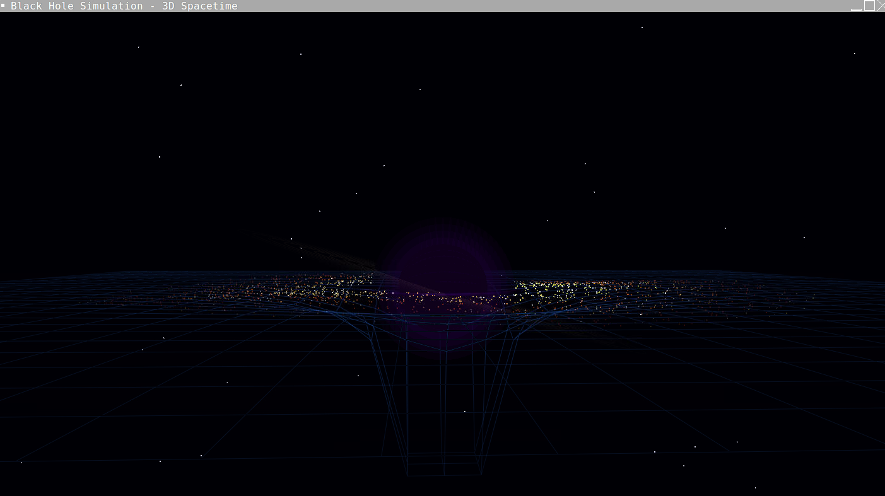

# Simulação de Buraco Negro 3D

Uma simulação visual interativa de um buraco negro distorcendo o tecido do espaço-tempo, desenvolvida em C++ com OpenGL.

 

## O que você vai ver

<p align="center">
  
</p>


- **Buraco Negro**: Esfera negra central representando o horizonte de eventos
- **Tecido do Espaço-Tempo**: Grade 3D azul que se curva ao redor do buraco negro (efeito da gravidade)
- **Disco de Acreção**: Milhares de partículas coloridas orbitando o buraco negro
- **Lente Gravitacional**: Efeito visual da luz sendo curvada pela gravidade
- **Campo Estelar**: Estrelas de fundo para ambientação

## Controles

| Controle | Ação |
|----------|------|
| Arrastar com mouse | Rotacionar a câmera |
| Scroll do mouse | Zoom in/out |
| `+` ou `=` | Aumentar massa do buraco negro |
| `-` | Diminuir massa do buraco negro |
| `Espaço` | Pausar/continuar animação |
| `R` | Resetar simulação |
| `Q` ou `ESC` | Sair |

---

## Como Rodar no Seu PC (Windows)

### Passo 1: Instalar o compilador C++

1. Baixe o **MSYS2** em: https://www.msys2.org/
2. Execute o instalador e siga as instruções
3. Abra o terminal **MSYS2 UCRT64** (procure no menu iniciar)
4. Execute estes comandos para instalar as ferramentas:

```bash
pacman -Syu
pacman -S mingw-w64-ucrt-x86_64-gcc
pacman -S mingw-w64-ucrt-x86_64-freeglut
pacman -S mingw-w64-ucrt-x86_64-mesa
pacman -S make
```

### Passo 2: Configurar o VS Code

1. Instale a extensão **C/C++** da Microsoft no VS Code
2. Instale a extensão **Code Runner** (opcional, facilita execução)
3. Adicione o caminho do MSYS2 ao PATH do Windows:
   - Abra "Variáveis de Ambiente" no Windows
   - Edite a variável PATH do usuário
   - Adicione: `C:\msys64\ucrt64\bin`

### Passo 3: Baixar o Projeto

1. Baixe todos os arquivos do projeto
2. Coloque em uma pasta, ex: `C:\Projetos\BlackHoleSimulation`
3. Abra a pasta no VS Code

### Passo 4: Compilar e Executar

**Opção A - Pelo Terminal:**
```bash
cd C:\Projetos\BlackHoleSimulation
make
./black_hole_simulation.exe
```

**Opção B - Comando direto:**
```bash
g++ -std=c++11 -o black_hole_simulation src/main.cpp -lfreeglut -lopengl32 -lglu32
./black_hole_simulation.exe
```

---

## Como Rodar no Seu PC (Linux - Ubuntu/Debian)

### Passo 1: Instalar dependências

```bash
sudo apt update
sudo apt install build-essential freeglut3-dev mesa-utils
```

### Passo 2: Compilar e Executar

```bash
cd ~/caminho/para/BlackHoleSimulation
make
./black_hole_simulation
```

---

## Como Rodar no Seu PC (macOS)

### Passo 1: Instalar Homebrew e dependências

```bash
/bin/bash -c "$(curl -fsSL https://raw.githubusercontent.com/Homebrew/install/HEAD/install.sh)"
brew install freeglut
```

### Passo 2: Compilar e Executar

```bash
cd ~/caminho/para/BlackHoleSimulation
g++ -std=c++11 -o black_hole_simulation src/main.cpp -framework OpenGL -framework GLUT
./black_hole_simulation
```

---

## Estrutura do Projeto

```
BlackHoleSimulation/
├── src/
│   └── main.cpp           # Código fonte principal
├── Makefile               # Script de compilação
├── README.md              # Este arquivo
└── .gitignore             # Arquivos ignorados pelo git
```

## Requisitos Técnicos

- **Compilador**: g++ com suporte a C++11
- **Bibliotecas**: OpenGL, GLU, FreeGLUT
- **Sistema Operacional**: Windows 10+, Linux ou macOS
- **Placa de vídeo**: Qualquer GPU com suporte a OpenGL 2.0+

## Solução de Problemas

### "freeglut não encontrado"
- Windows: Verifique se o MSYS2 foi instalado corretamente e o PATH está configurado
- Linux: Execute `sudo apt install freeglut3-dev`

### "libGL não encontrado"
- Linux: Execute `sudo apt install mesa-utils libgl1-mesa-dev`

### Janela não abre
- Verifique se os drivers de vídeo estão atualizados
- Tente executar pelo terminal para ver mensagens de erro

### Tela preta
- A simulação pode demorar alguns segundos para carregar
- Tente mover o mouse para rotacionar a câmera

## Licença

Este projeto é livre para uso educacional e pessoal.
